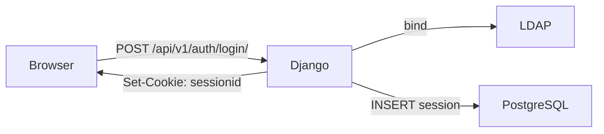
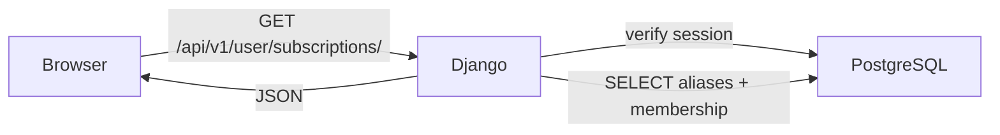
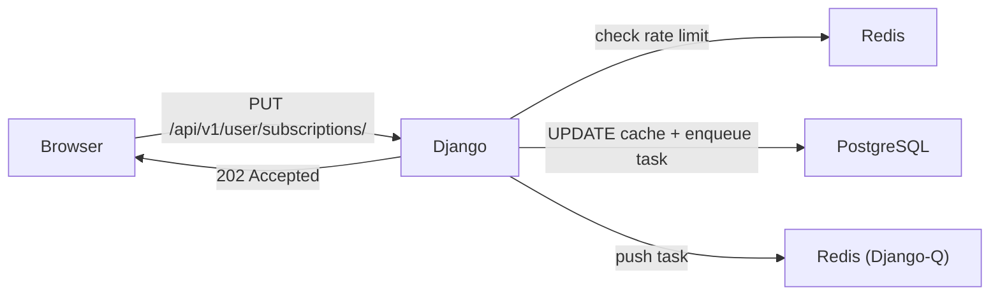
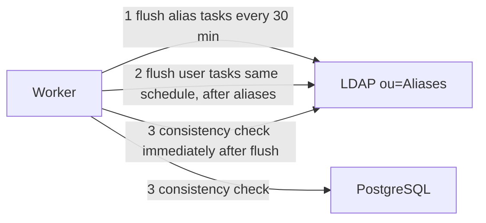

# Mail Subscription System

A web-based management interface for department mail alias subscriptions. Users log in with their department LDAP credentials, then subscribe or unsubscribe from mailing list aliases. Admins can create and delete aliases and manage their members.

**LDAP is the single source of truth.** PostgreSQL is a cache that is periodically synced and consistency-checked against LDAP.

---

## Infrastructure Overview

The system spans seven machines. This repository covers the app stack deployed on **mail1/2/3**.

| Machine | IP | Role |
|---------|-----|------|
| mail1 | 172.16.127.102 | App server — default primary (DB/Redis primary, LDAP flush) |
| mail2 | 172.16.127.116 | App server — standby |
| mail3 | 172.16.127.117 | App server — standby |
| mail4 | 172.16.127.118 | Mail infrastructure — Postfix + Mailpit |
| mail5 | 172.16.127.124 | Nginx reverse-proxy |
| mail6 | 172.16.127.125 | Nginx reverse-proxy |
| mail7 | 172.16.127.126 | Nginx reverse-proxy |

`mailsus.csie.org` resolves to mail5, mail6, and mail7 for HTTP-level HA. Each nginx reverse-proxies using two upstream pools:

- **Backend** (`/api/`, `/admin/`): round-robin across mail1/2/3 port 8000 (Django)
- **Frontend** (`/`): ip\_hash across mail1/2/3 port 55111 (React/Vite, sticky by client IP)
- **Mailpit** (`/mailpit/`): proxied to mail4 port 8025

All three app servers serve HTTP traffic simultaneously. The **monitor daemon** (a systemd service on each of mail1/2/3) runs a leader election to designate exactly one machine as ACTIVE — the one that is the PostgreSQL/Redis primary and the only machine allowed to flush changes to LDAP. Standby machines point their DB/Redis connections at the active primary via `.env.role`.

The LDAP server (`ldaps://172.16.127.109:636`) is maintained by the department identity service team and is not part of this repository.

---

## Tech Stack (this repo)

| Layer | Technology | Role |
|-------|-----------|------|
| Frontend | React + Vite | Subscription UI, admin management interface |
| Backend | Django + DRF | REST API, authentication, business logic |
| Database | PostgreSQL | Alias cache, task queue |
| Task queue broker | Redis index 0 | Django-Q task queue |
| Rate-limit cache | Redis index 1 | Per-user cooldown TTL keys |
| Background worker | Django-Q | LDAP flush, consistency check |
| Authentication | LDAP (`django-auth-ldap`) | User credentials, admin group membership |
| HA coordinator | monitor daemon (`scripts/monitor/`) | Leader election, role switching, DB sync |

---

## Data Flows

### Login


### Fetch Subscriptions


### Update Subscription


### Background Sync (Django-Q worker, ACTIVE only)


---

## Repository Layout

```
.
├── apps/                    # Django apps (accounts, subscriptions, ...)
├── core/                    # Django project settings, root URL config
├── frontend/                # React + Vite source
├── scripts/
│   ├── monitor/
│   │   ├── monitor.py           # HA monitor daemon
│   │   ├── monitor.env.example  # Config template for /etc/mailsub/monitor.env
│   │   ├── mailsub-monitor.service  # systemd unit file
│   │   └── test_monitor.py
│   ├── db_sync.sh           # PostgreSQL primary -> replica sync script
│   ├── vc-local.sh          # Vulnerability check stage 1: local Django deploy check
│   └── vc-remote.sh         # Vulnerability check stage 2: remote Trivy/auth/port scan
├── docs/                    # Architecture and operations documentation
├── docker-compose.yml       # Defines postgres, redis, web, worker, frontend
├── Dockerfile               # Backend image (Django + pg client tools)
├── .env.example             # Template for .env
└── .env.role.example        # Template for .env.role (written by monitor in HA)
```

Files that live **on the host machine** but are not in this repository:

| Path | Purpose |
|------|---------|
| `/etc/mailsub/monitor.env` | Monitor daemon runtime config (IPs, thresholds, paths) |
| `/var/lib/mailsub/` | `LAST_SYNC_FILE` directory, bind-mounted into the worker container |

---

## Quick Start (Single Node)

**Prerequisites:** Docker, Docker Compose, and a reachable LDAP server with its CA certificate.

**1. Configure environment**

```bash
cp .env.example .env
cp .env.role.example .env.role
```

Edit `.env` at minimum:

```bash
LDAP_URI=ldaps://172.16.127.109:636
LDAP_CA_CERT_FILE=/path/to/ca.crt   # path inside the container
LDAP_BIND_DN=uid=mailtest,ou=people,dc=csie,dc=ntu,dc=edu,dc=tw
LDAP_BIND_PASSWORD=<service-account-password>
```

**2. Start services**

```bash
docker compose up -d
```

**3. Initialize the database** (first run or after model changes)

```bash
docker compose exec web python manage.py migrate
```

The frontend is available at `http://localhost:55111` and the Django API at `http://localhost:8000`.

**Stop services**

```bash
docker compose down        # stop, keep volumes
docker compose down -v     # stop and delete database volumes
```

---

## HA Deployment

In production, the same `docker-compose.yml` runs on all three of mail1, mail2, and mail3. The monitor daemon runs as a systemd service on each host (outside the containers) and handles:

- Leader election (exactly one ACTIVE at a time)
- Writing `.env.role` with the current DB/Redis primary IP and `FLUSH_ENABLED`
- Restarting web/worker containers when the role changes
- Scheduling `db_sync.sh` to replicate PostgreSQL from primary to standbys

**Install the monitor daemon (on each of mail1/2/3)**

```bash
# 1. Create config directory and copy template
sudo mkdir -p /etc/mailsub
sudo install -m 0640 scripts/monitor/monitor.env.example /etc/mailsub/monitor.env

# Edit /etc/mailsub/monitor.env — set THIS_MACHINE_IP, THIS_MACHINE_NAME, MONITOR_PEERS

# 2. Install and enable the systemd service
sudo install -m 0644 scripts/monitor/mailsub-monitor.service /etc/systemd/system/
sudo systemctl daemon-reload
sudo systemctl enable --now mailsub-monitor

# 3. Verify
sudo systemctl status mailsub-monitor
curl http://127.0.0.1:9123/health
```

See [`docs/HA.md`](docs/HA.md) and [`docs/monitor.md`](docs/monitor.md) for failover rules, thresholds, and DB sync behavior.

---

## Documentation

| Doc | Contents |
|-----|---------|
| [`docs/setup.md`](docs/setup.md) | Environment variables, Docker operations, first-time setup |
| [`docs/HA.md`](docs/HA.md) | HA deployment — machine roles, failover/failback rules |
| [`docs/monitor.md`](docs/monitor.md) | Monitor daemon design, leader election, health checks |
| [`docs/ldap.md`](docs/ldap.md) | LDAP directory structure, read/write permissions, task ordering |
| [`docs/database.md`](docs/database.md) | PostgreSQL schema (alias, task queue tables) |
| [`docs/auth.md`](docs/auth.md) | Login flow, RBAC, session cookie, CSRF |
| [`docs/sync.md`](docs/sync.md) | Background worker, flush schedule, retry logic |
| [`docs/api.md`](docs/api.md) | API endpoints, request/response format |
| [`docs/testing.md`](docs/testing.md) | Automated tests |
| [`docs/logs.md`](docs/logs.md) | Logging setup, structured logs, Loki/Grafana |
| [`docs/open-decisions.md`](docs/open-decisions.md) | Unresolved design decisions |
