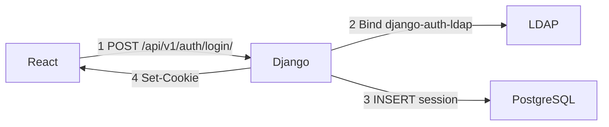
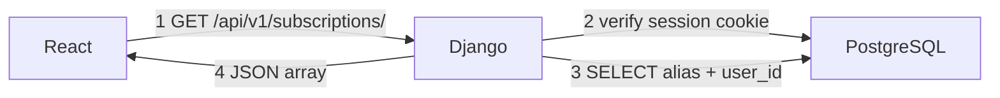
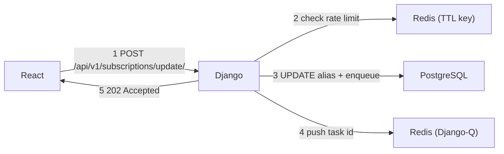
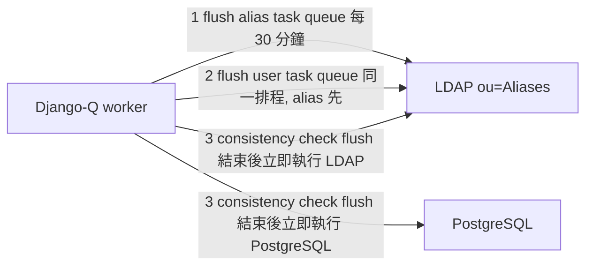

# Mail Subscription System — Architecture Overview

系上 mail alias 訂閱管理系統。使用者登入後選擇訂閱或退訂各個 alias；Admin 可管理 alias 成員與 alias 本身。

**核心原則：LDAP 是唯一的 source of truth。** PostgreSQL 是 cache，定期與 LDAP 同步驗證一致性。

---

## Tech Stack

| 層級 | 技術 | 職責 |
|------|------|------|
| 前端 | React + Vite | 訂閱 UI、Admin 管理介面 |
| 後端 | Django + DRF | API、身份驗證、業務邏輯 |
| 資料庫 | PostgreSQL | Alias cache、Task queue |
| Task queue | Redis index 0 | Django-Q task queue |
| Cache | Redis index 1 | Rate limit TTL |
| 背景工作 | Django-Q worker | LDAP 同步、Consistency check |
| 身份驗證 | LDAP（`django-auth-ldap`）| 使用者帳密、Admin 群組判定 |

---

## Data Flows

### Login

### Fetch Subscription Data

### Update Subscription

### Background Sync (Django-Q worker)

---

## Doc Index

| 文件 | 內容 |
|------|------|
| [setup](./docs/setup.md) | 環境變數、Docker 操作、初次建置 |
| [HA](./docs/HA.md) | 高可用部署（多機、DB/Redis 主備） |
| [monitor](./docs/monitor.md) | HA monitor daemon 設計與行為 |
| [ldap](./docs/ldap.md) | LDAP 目錄結構、讀寫權限、指令格式、task 優先順序 |
| [database](./docs/database.md) | PostgreSQL schema（alias、task_queue） |
| [auth](./docs/auth.md) | 登入流程、RBAC、Session Cookie、CSRF |
| [sync](./docs/sync.md) | Background worker、flush 排程、retry 機制 |
| [api](./docs/api.md) | API endpoints、request / response 格式 |
| [open-decisions](./docs/open-decisions.md) | 尚未決定的技術細節 |
| [testing](./docs/testing.md) | 自動化測試 |
