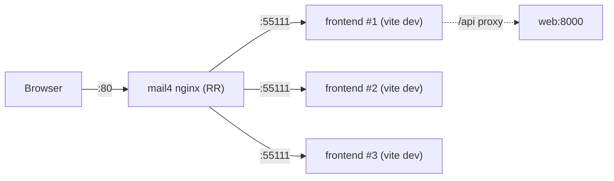
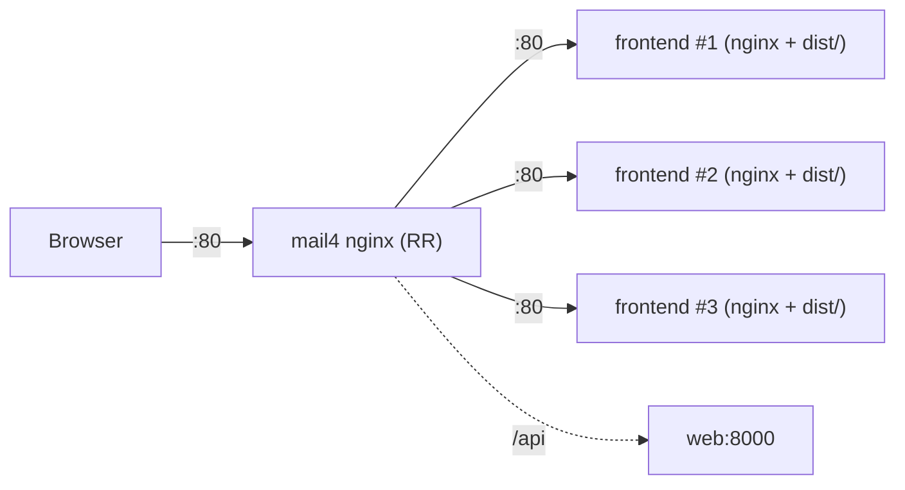

# Frontend Production Static-Build Proposal

## Goal

將 frontend 從「production 直接跑 Vite **dev server**」改為「**multi-stage build** 產生靜態 `dist/`，由 nginx 提供」，以：

1. 消除 image 內 `node_modules` 帶來的 11 個 dev-dependency CVE（`cross-spawn` / `glob` / `minimatch` / `tar`）。
2. 符合 production 最佳實務（dev server 不適合對外服務：效能差、watch/HMR overhead、暴露原始碼）。

> 本案是 [vc.md](./vc.md) 中 frontend image CVE 的根本解。因牽涉 serving model 與 nginx 設定，獨立成案，不夾帶進 VC branch。

---

## 現況（As-is）



- `frontend/Dockerfile`：`node:20-alpine` → `npm install` → `EXPOSE 3000`。
- `docker-compose.yml` frontend service：
  - `command: npm run dev -- --host 0.0.0.0`（**dev server**）
  - `volumes: ./frontend:/app` + 匿名 `/app/node_modules`（掛 source、保留 node_modules）
  - port `${VITE_PORT:-55111}`
- `frontend/vite.config.js`：dev server 同時負責**兩件事**
  1. 編譯/提供 React app
  2. `server.proxy` 把 `/api` 轉發到 `VITE_API_TARGET`（`http://web:8000`）
  3. HMR websocket 透過 nginx:80 回連 55111
- mail4 nginx 以 RR 將請求分散到三台 frontend container。

**問題**：dev server 跑在 production →
- 整個 build toolchain（`cross-spawn`/`glob`/`minimatch`/`tar` …）留在 image 內 → Trivy 報 11 HIGH。
- 每次請求 on-the-fly 編譯、watch 檔案，效能與資源都不理想。
- 原始碼與 source map 對外可見。

---

## 提案（To-be）



### 1. `frontend/Dockerfile` 改 multi-stage

```dockerfile
# ---- build stage ----
FROM node:20-alpine AS build
WORKDIR /app
COPY package*.json ./
RUN npm ci
COPY . .
# VITE_API_BASE 等 build-time 變數於此 baked-in（見「待決 D-2」）
RUN npm run build          # 產生 /app/dist

# ---- serve stage ----
FROM nginx:alpine
COPY --from=build /app/dist /usr/share/nginx/html
# 若 /api 由本層 nginx 代理，於此 COPY 一份 nginx.conf（見「待決 D-1」）
EXPOSE 80
```

最終 image **不含 `node_modules`** → 11 個 CVE 全消。

### 2. `docker-compose.yml` frontend service 連動

- 移除 `command: npm run dev ...`（image 直接由 nginx 提供服務）。
- 移除 `volumes: ./frontend:/app` 與 `/app/node_modules`（不再掛 source）。
- port 改對應 nginx 的 `80`（對外仍由 mail4 RR）。

### 3. `/api` 代理改由 nginx 接手

dev server 的 `server.proxy` 在靜態模式不存在，`/api` 轉發必須移到 nginx（每台 frontend 容器內的 nginx，或 mail4 nginx）。

---

## 待決（Open Decisions）

| # | 主題 | 選項 |
|---|------|------|
| D-1 | `/api` proxy 落在哪一層 | (a) 每台 frontend 容器內附 nginx 代理 `/api → web:8000`；(b) 由 mail4 nginx 統一處理 `location /api`。影響 mail4 設定擁有者。 |
| D-2 | API base URL 注入時機 | dev server 是 runtime 讀 `VITE_API_TARGET`；靜態 build 時 `VITE_*` 在 **build-time** baked-in。需決定改用 build arg，或前端一律走相對路徑 `/api` 交給 nginx。 |
| D-3 | RR 目標 port | `55111` → `80`（或維持 55111 讓 mail4 設定不動）。 |
| D-4 | HMR | 靜態模式無 HMR，`vite.config.js` 的 `hmr.clientPort` 可移除；dev 環境是否另留一份 compose override。 |

> 上述決策牽涉 mail4 nginx 設定（非本 repo VC 範圍、由 infra/nginx owner 維護），需跨組協調後再實作。

---

## 影響範圍與風險

- **跨組**：`/api` 與 RR 改動會碰到 mail4 nginx 設定擁有者。
- **API routing 行為改變**：proxy 從 vite 移到 nginx，需驗證 cookie/CSRF（`cookieDomainRewrite`、`changeOrigin` 等價設定）。
- **dev 體驗**：開發者本機仍需 `npm run dev`；建議用 `docker-compose.override.yml` 保留 dev server，不影響 production image。

---

## 驗收

```sh
# 1) image 內無 node_modules、Trivy 乾淨
docker compose build --no-cache frontend
trivy image --severity HIGH,CRITICAL --ignore-unfixed <frontend-image>   # 0 結果

# 2) 靜態頁面可服務
curl -sI http://127.0.0.1/                # 200，由 nginx 回

# 3) /api 正常（登入流程、cookie、CSRF 一致）
curl -s http://127.0.0.1/api/v1/...        # 經 nginx 正確打到 web:8000
```

三台 frontend 都過、且 mail4 RR 後端切換正常，才算完成。

---

## 暫行（Interim，本案落地前）

不阻塞 VC：先在 dev-server 模型下升版四個套件，清掉 Trivy 報的項目（`tar` 為 major bump，必要時用 `package.json` `overrides`）：

```sh
cd frontend
npm update cross-spawn glob minimatch
# tar 需 6→7 major：
#   "overrides": { "tar": "^7.5.11" }  後 npm install
docker compose build --no-cache frontend
```

殘留（升不動者）記錄為 **dev-tool / dev-server 風險**：皆為 build 工具的 DoS / path-traversal，靜態服務不對遠端暴露觸發面，real-world 風險低。
